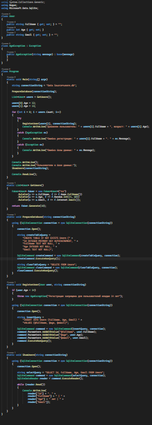
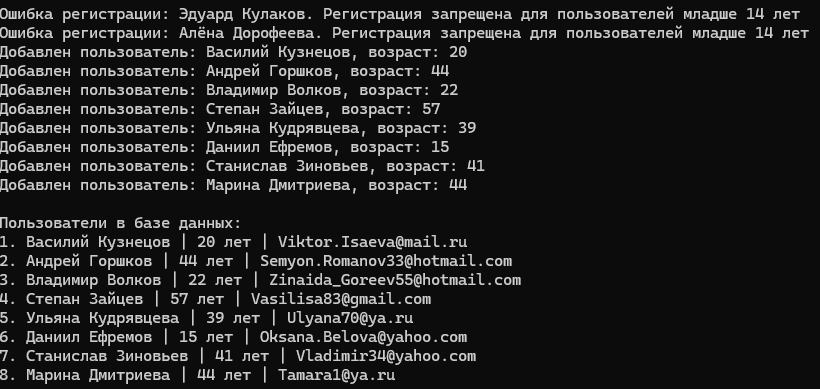

# C# KT3

Решить задачу

Подключить faker в проект, полученные данные (10 человек) передаем в базу данных, прописываем исключение - регистрация запрещена для пользователей младше 14 лет.

### Код

### Результат

